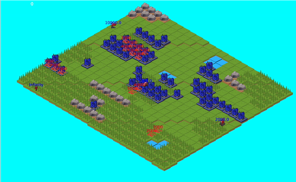

# Simulation d'extinction de feu sur une carte par des robots pompiers

Projet réalisé à l'Ensimag. Il consiste à tester différentes stratégies d'exctinction de feu pour voir laquelle est la meilleure. Les simulations sont réalisées sur des cartes différentes et aux terrains variés. 

# Compilation

Pour compiler le projet : 

/!\ Commandes à lancer à la racine du projet /!\

- Pour tester la classe Evenement, taper : make testEvent

- Pour tester si le projet fonctionne sur chaque map, taper : make testProject
  (Note : Le test sur la carte spiralOfMadness est un peu long car les feux sont long à éteindre)

- Pour nettoyer le dossier, taper : make clean

